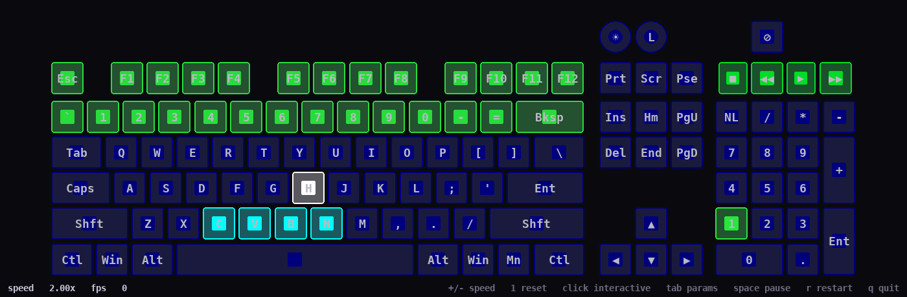

# Brick Breaker

A self-playing brick-breaker game that uses your keyboard as the
playfield. Each game restart rolls a new "AI player" with randomized
skill, so runs range from comically bad (loses on level 1) to brilliant
(clears all 36 levels).



## Install

```sh
mkdir -p ~/.local/share/ckb-next/animations
cp brickbreaker ~/.local/share/ckb-next/animations/
chmod +x ~/.local/share/ckb-next/animations/brickbreaker
```

In the ckb-next GUI: **Settings → Animation Scripts → Re-scan**, then
add **Brick Breaker** to a mode. In **Properties → Settings → Playback**,
enable **"Start with mode"**. Brick Breaker doesn't read keypresses, so
you don't need "Start with key press".

## Features

- **Progressive levels.** 36 levels with increasing ball speed and a
  brick HP distribution that shifts toward harder bricks. Paddle speed
  stays fixed, so the AI naturally gets less accurate at high speeds.
- **Multi-hit bricks.** Color-coded by remaining HP — red (3),
  yellow (2), green (1).
- **Arkanoid-style paddle physics.** Ball deflection comes from both
  hit-position and paddle friction (the paddle's own motion drags the
  ball). Speed bleeds back to base over ~3 seconds so boosts don't
  accumulate.
- **AI strategy.** Uses a setup-and-glide technique — positions the
  paddle to the opposite side of the desired deflection, then slides
  through the impact point at impact time to impart velocity.
- **Randomized AI skill per game.** Beta(3,3)-distributed skill drives
  paddle speed, prediction error, and aim aggressiveness. Most runs are
  average; very-bad and very-good AIs are rare.
- **Power-up drops** (rate-limited, ~one per 20–30s):
  - LONGER (green) — +1 paddle key
  - SHORTER (red) — −1 paddle key (AI tries to avoid)
  - MULTIBALL (cyan) — +2 balls (cap 3)
  - EXTRA_LIFE (magenta) — +1 life (cap 4)
- **Numpad level counter.** Tiered display:
  - 1–9: num1..num9 cumulative in green
  - 10–18: numlock + num1..num9 in yellow
  - 19–27: numlock+numslash + num1..num9 in orange
  - 28–36: numlock+numslash+numstar + num1..num9 in red
  - 37+: saturated red pulse
- **Game flow.** Miss → red flash → life lost. 0 lives → red strobe →
  reset to level 1. All bricks cleared → rainbow strobe → next level.

## Tunable parameters (in the ckb-next GUI)

| Param | Default | Range | Notes |
| --- | --- | --- | --- |
| `basespeed` | 60.0 | 20.0–200.0 | Base ball speed at level 1, keys/sec |
| `maxspeed` | 110.0 | 30.0–300.0 | Cap on ball speed at level 1 after paddle-friction boosts |
| `paddlespeed` | 110.0 | 20.0–300.0 | Paddle movement speed; fixed across all levels |
| `paddlewidth` | 4 | 2–8 | Starting paddle width in keys, before power-ups |
| `levelspeed` | 0.12 | 0.0–0.5 | Fractional speed boost per level beyond 1 (e.g. 0.12 = +12% per level) |
| `chaos` | 0.20 | 0.0–1.0 | Randomness applied to ball deflection |
| `aimstrength` | 0.50 | 0.0–1.0 | AI aim aggressiveness (multiplied by per-game rolled AI skill) |
| `dropchance` | 0.5 | 0.0–1.0 | Probability a destroyed brick drops a power-up; **0 disables drops entirely** |
| `dropcooldown` | 25.0 | 5.0–120.0 | Minimum seconds between power-up drops |
| `paddlefriction` | 0.6 | 0.0–1.0 | Fraction of paddle motion imparted to the ball |
| `ballcolor` | `ffffffff` | ARGB | Ball color (white) |
| `paddlecolor` | `ff00ffff` | ARGB | Paddle color (cyan) |

## Test harness extras

Brickbreaker declares the following [test harness](test-harness.md)
opt-in extras, so you can poke at the AI without recompiling:

- `harness speed default=5.0 …` — the harness opens with speed at 5×,
  and `+` / `-` scrub it live so you can fast-forward through levels.
- `harness param ai_skill / ai_paddle_mult / ai_pred_error / ai_aim_mult`
  — set any of these to a number to force a specific AI character
  (e.g. `ai_skill=0.95` for a brilliant player), or leave them on
  `auto` to keep the per-game Beta(3,3) randomization. Changes take
  effect immediately on the running game.
