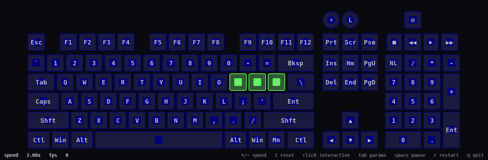

# Snake

A self-playing classic snake. The snake spawns small in the middle of
the keyboard, hunts down dots that appear in unoccupied cells, grows
each time it eats one, and speeds up the longer it gets. It dies if it
runs into its own body or off the edge of its playfield. After death
it respawns small.



## Install

```sh
mkdir -p ~/.local/share/ckb-next/animations
cp snake ~/.local/share/ckb-next/animations/
chmod +x ~/.local/share/ckb-next/animations/snake
```

In the ckb-next GUI: **Settings → Animation Scripts → Re-scan**, then
add **Snake** to a mode. In **Properties → Settings → Playback**,
enable **"Start with mode"**. Snake doesn't read keypresses (kpmode
none) — the snake plays itself.

## How the playfield is built

The keyboard isn't a perfect grid, so the script infers a 4-connected
adjacency at startup: for each key it finds the nearest neighbor in
N/S/E/W within a tolerance derived from the median key spacing. The
snake is then confined to whichever connected component it spawned in
— normally the entire keyboard for a K70 ANSI layout (all 111 keys
form one connected component once the staggered-row offsets are
absorbed). On boards with isolated key clusters (separated numpads,
floating media keys), those will simply stay dark for the snake.

## AI strategy

1. **Greedy chase.** BFS from the head to the nearest reachable dot,
   treating mid-body cells as obstacles (the tail is passable since it
   leaves the cell on the next move). The first step on the shortest
   path becomes the chosen direction.
2. **Open-space wander.** If no dot is reachable, the snake picks the
   legal move that maximises reachable empty space (flood fill) — a
   cheap way to avoid trapping itself in a pocket of body.
3. **Death.** If no legal move exists, the snake dies, strobes red for
   ~1.5s, then respawns small.

## Speedup as it grows

Move period shrinks linearly with length, floored at `min_period`:

```
period = max(min_period, base_period - growth_speedup * (length - 1))
```

So a default-tuned snake at length 1 moves every 0.35s; by length 30
it's at ~0.21s; by length 59 it hits the 0.06s floor. Set
`growth_speedup=0` to disable speedup entirely.

## Tunable parameters (in the ckb-next GUI)

| Param | Default | Range | Notes |
| --- | --- | --- | --- |
| `base_period` | 0.35 | 0.05–2.0 | Seconds per move at initial length |
| `min_period` | 0.06 | 0.02–1.0 | Floor on move period; protects from unplayable speeds at long lengths |
| `growth_speedup` | 0.005 | 0.0–0.05 | Seconds shaved off the move period per added segment; `0.0` disables speedup |
| `initial_length` | 3 | 1–10 | Length the snake spawns (and respawns) at |
| `dot_ttl` | 8.0 | 1.0–60.0 | Seconds a dot stays on the board before vanishing |
| `dot_interval` | 2.5 | 0.2–30.0 | Seconds between dot-spawn attempts |
| `max_dots` | 3 | 1–10 | Cap on simultaneous dots |
| `head_color` | `ffe0ffe0` | ARGB | Head color (pale green-white) |
| `body_color` | `ff00c800` | ARGB | Body color; tail end fades toward black |
| `dot_color` | `ffff2030` | ARGB | Dot color; dots blink in the last 1.5s of their TTL |

### Presets

- **Default** — balanced settings (above defaults).
- **Slow & long-lived** — `base_period=0.30 growth_speedup=0.002
  dot_ttl=15.0 dot_interval=4.0`. Long, lazy game.
- **Frantic** — `base_period=0.10 growth_speedup=0.003 dot_ttl=4.0
  dot_interval=1.0 max_dots=5`. Hectic; many dots, short lives.

## Test harness extras

Snake declares `harness speed default=1.0 min=0.1 max=20.0` so you can
fast-forward gameplay (e.g. crank to 10× to see how the snake fills the
board, then back down to watch it try to escape).
